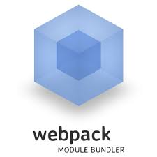

# Diving into Webpack

## Why

* ***Browserify*** was born to make your Node code (commonJS) in the browser
* ***Like browserify***, webpack takes commonJS files and bundles them for the browser. But it also supports AMD, Bower, SystemJS module formats.
* ***It often replaces grunt or gulp*** because it can build and bundle CSS, preprocessed CSS, compile-to-JS languages and images, among other things.

See: [http://browserify.org/](http://browserify.org/)
See: [https://webpack.github.io/](https://webpack.github.io/)user

## Install

    // webpack
    npm install webpack -g

## Initial setup

create package.json

    # create package.json
    npm init

    # add local webpack
    # this ensure we have control over the webpack version
    npm install webpack --save-dev

userService.js

    // simple user service
    function userService() {
        this.getById = function(id) {
            return { id: 123, name: 'peter' }
        }
        this.getAll = function() {
            return [
                { id: 123, name: 'peter' },
                { id: 222, name: 'robbert' }
            ]
        }
    }

    // expose userService to other modules
    module.exports = new userService();

main.js

    var userService = require('./userService');
    var users = userService.getAll();
    users.forEach(function(user) {
       console.log(user.id, user.name);
    });

index.html

    <html>
        <head>
            <meta charset="utf-8">
        </head>
        <body>
            <ul id="list" />
            
        </body>
    </html>

### Bundle it

    // browserify
    browserify main.js > bundle.js

    // webpack
    webpack main.js bundle.js

> Check if it works by serving the index.html

### WebPack config file

minimal config

    // webpack.config.js
    module.exports = {
        entry: './main.js',
        output: {
            filename: 'bundle.js'
        }
    };

a more complete config

    // webpack.config.js
    module.exports = {
        entry: './main.js',
        output: {
            path: __dirname + '/dist'
            filename: 'bundle.js',
            publicPath: "/assets/"
        },
        resolve: {
            root: __dirname,
            extensions: ['', '.ts', '.js', '.json'],
        },
        module: {
            loaders: [...],
            preLoaders: [...],
        },
        plugins: [...]
    };

### Bundle it

    webpack         // for building once for development
    webpack -p      // for production (minification)
    webpack --watch // watch file changes and rebuild
    webpack -d      // include source maps

### Add a external library

add jquery

    npm install jquery --save

add some html

    <ul id="list" />

and use it

    // main.js
    var userService = require('./userService');
    var $ = require('jquery');

    var users = userService.getAll();
    users.forEach(function(user) {
        $('#list').append('<li>' + user.name + '</li>');
    });

> You can still use [bower components](http://webpack.github.io/docs/usage-with-bower.html) but its preferable to use the CommonJs-style module and let webpack build it.

## Loaders

### Transpiling Javascript & css

Lets write some ES6

    // userService.js
    class userService {
        constructor() {
        }
        getById(id) {
            return { id: 123, name: 'peter' }
        }
        getAll() {
            return [
                { id: 123, name: 'peter' },
                { id: 222, name: 'robbert' },
                { id: 222, name: 'jan' }
            ]
        }
    }

Configure a loader for ES6

    // webpack.config.js
    module.exports = {
        entry: './main.js',
        output: {
            filename: 'bundle.js'
        },
        module: {
            loaders: [
                { test: /\.js$/, loader: 'babel-loader' }
            ]
        }
    };

And install the loader

    npm install babel-loader --save-dev

Notice the following error

    [BABEL] Note: The code generator has deoptimised the styling of ...

You can exclude files from a loader

    module: {
        loaders: [
            {
                test: /\.js$/,
                loader: 'babel-loader',
                exclude: /(node_modules|bower_components)/
            }
        ]
    }

> Loaders available for [TypeScript](https://www.npmjs.com/package/typescript-loader), [CoffeeScript](https://www.npmjs.com/package/coffee-loader) and many more.

### Adding CSS

Install some more loaders:

    npm install style-loader css-loader url-loader --save-dev

Add the new modules to the loaders section in your webpack.config.js

    { test: /\.css$/, loader: 'style-loader!css-loader' }

Add a style sheet

    // style.css
    body {
        background: tomato;
    }

And require the file in your main.js

    require("./styles.css");

> Re-run webpack from the command line and “ta-da”!

### Adding images

Install some more loader(s):

    npm install url-loader html-loader --save-dev

Add the new loaders

    { test: /\.(png|jpg)$/, loader: 'url-loader?limit=8192'}

Add an image and require it

    // index.html
    

    // main.js
    $('#img').attr('src', require("./euricom.png"));

> Re-run webpack from the command line and “ta-da,ta-da”!

When the image is not embedded it is important to specify the 'publicPath'

    output: {
        path: __dirname + '/dist'
        filename: 'bundle.js',
        publicPath: "/assets/"
    }

### Move to sass

Add loader

    // install
    npm install sass-loader --save-dev

    // webpack.config.js
    { test: /\.scss$/, loader: 'style!css!sass'}

    // rename your css to sass
    mv style.css style.scss

    // and write some sass code
    $primary-color: LightGray;
    body {
        background: $primary-color;
    }

> Notice we can omit the '-loader'

### Css options

    // with source maps
    { test: /\.scss$/, loader: 'style!css?sourceMap!sass'}

    // with without minimize
    { test: /\.scss$/, loader: 'style!css?sourceMap&-minimize!sass'}

### See also

http://webpack.github.io/docs/using-loaders.html

### Pre-loaders

Sometime you want a loader in front of all others.

Example of a jshint-loader

    module: {
        preLoader: [
            { test: /\.js$/, loader: "jshint-loader" }
        ]
    }

> Remark: make sure your don't lint your node_modules, use 'include' or 'exclude'

## Plugins

Global extentions on top of the WebPack functionality

Plugin configuration

    module.exports = {
        entry: './main.js',
        output: {
            filename: 'bundle.js'
        },
        plugins: [...]
    };

### Feature flags - webpack.DefinePlugin

We have code we want to gate only to our dev environments (like logging)

    if (__DEV__) {
        console.warn('Extra logging');
    }
    // ...
    if (__PRERELEASE__) {
        showSecretFeature();
    }

Then teach webpack those magic globals:

    // definePlugin takes raw strings and inserts them,
    // so you can put strings of JS if you want.
    var definePlugin = new webpack.DefinePlugin({
        __DEV__: JSON.stringify(JSON.parse(process.env.BUILD_DEV || 'true')),
        __PRERELEASE__: JSON.stringify(JSON.parse(process.env.BUILD_PRERELEASE || 'false'))
    });

    module.exports = {
      entry: './main.js',
      output: {
        filename: 'bundle.js'
      },
      plugins: [definePlugin]
    };

Then you can build with

    BUILD_DEV=1 BUILD_PRERELEASE=1 webpack

### Implicit require - webpack.ProvidePlugin

    // you can also implicit require a module
    var webpack = require('webpack');
    new webpack.ProvidePlugin({
        $:      "jquery",
        jQuery: "jquery"
    })

> Make $ and jQuery available in every module without writing require("jquery").

### Bower support - bower-webpack-plugin (3th party)

    // install
    npm install bower-webpack-plugin --save-dev

    // add plugin reference to config file
    var BowerWebpackPlugin = require('bower-webpack-plugin');

    // add plugin to list of plugins
    plugins: [
        new BowerWebpackPlugin({
          excludes: /.*\.less/
        }),
    ]

    // remove jquery from npm
    npm uninstall jquery --save

    // install it with bower
    bower init
    bower install jquery --save

Specify where to look for a module first

    // webpack.config.js
    resolve: {
        modulesDirectories: ['node_modules', 'bower_components'],
    }

### Other plugins

* utility
    - webpack.NoErrorsPlugin: stop processing when there are errors
    - html-webpack-plugin: include html templates into the package
    - extract-text-webpack-plugin: extract css from package
    - browser-sync-webpack-plugin: add browsersync for watch mode
* optimize
    - webpack.optimize.UglifyJsPlugin: add javascript minification
    - webpack.optimize.DedupePlugin (beta): remove duplicates
    - webpack.optimize.CommonsChunkPlugin: create common chunk
    - compression-webpack-plugin: compresses the package

### See also

http://webpack.github.io/docs/list-of-plugins.html

## Development Server

    // install
    npm install webpack-dev-server -g

    // and run it
    webpack-dev-server --progress --colors
    webpack-dev-server --progress --colors --devtool eval
    webpack-dev-server --progress --colors --devtool cheap-eval-source-map

    // open browser
    http://localhost:8080/webpack-dev-server/

### Hot Module Replacement

    webpack-dev-server --progress --colors --hot --inline

## Run it

Update your package.json script

    "scripts": {
        "build": "webpack --config webpack.config.js --bail -p --color,
        "serve": "webpack-dev-server --progress --colors --hot --inline",
    },

## There is more

* Async loading
* Multiple entrypoints

### Additional Exercises, if we have the time :)

* Use the 'webpack.DefinePlugin' to create build time variables
* Create two bundles with two entry points with common bundle
  (use webpack.optimize.CommonsChunkPlugin)
    - main.js
    - sub.js
* Add 'extract-text-webpack-plugin' to extract the css file in a separated file
  (start initially without sass)

## References

Typescript

* http://www.jbrantly.com/typescript-and-webpack/

Howto

* https://github.com/petehunt/webpack-howto

Configs

* https://github.com/brechtbilliet/angular-typescript-webpack
* https://github.com/webpack/example-app/blob/master/webpack.config.js
* https://github.com/webpack/karma-webpack
* https://gist.github.com/ericclemmons/40a2783313d157d8b448
* https://github.com/angular-class/NG6-starter

Advanced stuff

* http://jlongster.com/Backend-Apps-with-Webpack--Part-I
* http://jlongster.com/Backend-Apps-with-Webpack--Part-II

